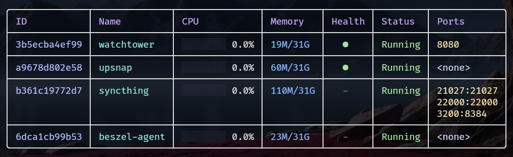

<div align="center">

# 🐋 dof

> A beautiful, blazing-fast terminal Docker container view and real-time stats.


</div>

---

## 📖 About

`dof` is a colorful command-line utility for listing Docker containers, inspired by `duf` and `docker ps`.

It features a stunning table output with the **Catppuccin Mocha** color palette, rounded corners, and semantic color-coding for every column. Unlike the standard `docker ps`, dof reads container stats directly from Linux cgroups, delivering **~100ms** execution time instead of waiting for the Docker API.

All containers are shown by default (running, stopped, exited), with clear status indicators and beautiful gauges.



---

## ✨ Features

- ✅ **Beautiful table output** with rounded corners and the Catppuccin Mocha theme
- ✅ **Color-coded columns** — each column has its own Catppuccin color
- ✅ **CPU gauge** — visual gauge with Unicode blocks showing CPU usage percentage
- ✅ **Health indicator** — green/red/yellow dot for container health status
- ✅ **Status badge** — `Running` in green or `Stopped` with pink background
- ✅ **Port mapping** — displayed with yellow port numbers
- ✅ **Blazing fast** — reads container stats directly from Linux cgroups (~100ms)
- ✅ **All containers shown by default** — no more `docker ps -a` needed
- ✅ **Truncated IDs** by default (12 chars), with `--no-trunc` for full SHA

---

## 🛠️ Technologies

- [Rust](https://www.rust-lang.org/) — safe and fast systems language
- [bollard](https://crates.io/crates/bollard) — Docker API client for Rust
- [tabled](https://crates.io/crates/tabled) — beautiful terminal table rendering
- [make_colors](https://crates.io/crates/make_colors) — terminal color utilities
- [tokio](https://crates.io/crates/tokio) — async runtime
- **Catppuccin Mocha** — terminal color theme

---

## 📦 Prerequisites

- **Docker** daemon running and accessible (via `/var/run/docker.sock`)
- **Linux** with cgroup v2 support (`/sys/fs/cgroup/`)
- **Rust** toolchain (to build from source)
- A terminal that supports 256 colors for the best Catppuccin experience

```bash
# Verify Docker is running
docker info

# Verify Rust is installed
rustc --version
cargo --version
```

---

## 🚀 Installation

### One-line install (recommended)

```bash
curl -fsSL https://raw.githubusercontent.com/antraxbr666/dof/main/install.sh | bash
```

### Update / Uninstall

```bash
# Update to latest version
curl -fsSL https://raw.githubusercontent.com/antraxbr666/dof/main/install.sh | bash -s -- --update

# Uninstall
curl -fsSL https://raw.githubusercontent.com/antraxbr666/dof/main/install.sh | bash -s -- --uninstall
```

### From source

```bash
git clone https://github.com/antraxbr666/dof.git
cd dof
cargo build --release
sudo cp target/release/dof /usr/local/bin/
```

---

## 📚 Usage

```bash
# List all containers (including stopped/exited)
dof

# List only running containers
dof --running

# Show full container IDs without truncation
dof --no-trunc

# Show help
dof --help

# Show version
dof --version
```

### Output Columns

| Column   | Description                                              | Color       |
| -------- | -------------------------------------------------------- | ----------- |
| **ID**       | Container ID (truncated to 12 chars by default)        | Lavender    |
| **Name**     | Container name                                           | Teal        |
| **CPU**      | CPU usage percentage with visual gauge                   | Green       |
| **Memory**   | Memory used / total (e.g., `59M/31G`)                  | Blue        |
| **Health**   | Health status: filled circle (green=healthy)            | Green/Red   |
| **Status**   | `Running` (green) or `Stopped` (pink badge)              | Green/Pink  |
| **Ports**    | Mapped ports, one per line, numbers in yellow           | Yellow/Text |

### Theme

`dof` uses the **Catppuccin Mocha** flavor, a dark, soothing pastel theme:

- **Header**: mauve foreground text
- **ID**: lavender
- **Name**: teal
- **CPU**: green gauge
- **Memory**: blue
- **Health**: green for healthy, red for unhealthy, yellow for starting
- **Status**: green for Running, pink background for Stopped
- **Ports**: port numbers in yellow
- **Borders**: modern rounded corners

---

## ⚙️ How It Works

Instead of calling `docker stats` for each container (which can take ~2s per container), `dof` reads directly from the Linux cgroup filesystem at `/sys/fs/cgroup/system.slice/docker-<ID>.scope/`.

This provides:
- **CPU usage** from `cpu.stat` (calculated via two snapshots with 100ms interval)
- **Memory usage** from `memory.current`
- **Memory limit** from `memory.max`

Container metadata (name, status, ports) is still fetched from the Docker API via `bollard`, but stats are retrieved instantly from the filesystem.

---

## 🤝 Contributing

Contributions are welcome! Open an issue or send a PR.

1. Fork the project
2. Create your branch: `git checkout -b feature/my-feature`
3. Commit your changes: `git commit -m 'feat: add my feature'`
4. Push: `git push origin feature/my-feature`
5. Open a Pull Request

---

## ☠ Author

**antraX**
- 📧 Email: [antraxbr666@proton.me](mailto:antraxbr666@proton.me)

---

## 📄 License

```
MIT License

Copyright (c) 2026 antraX

Permission is hereby granted, free of charge, to any person obtaining a copy
of this software and associated documentation files (the "Software"), to deal
in the Software without restriction, including without limitation the rights
to use, copy, modify, merge, publish, distribute, sublicense, and/or sell
copies of the Software, and to permit persons to whom the Software is
furnished to do so, subject to the following conditions:

The above copyright notice and this permission notice shall be included in all
copies or substantial portions of the Software.

THE SOFTWARE IS PROVIDED "AS IS", WITHOUT WARRANTY OF ANY KIND, EXPRESS OR
IMPLIED, INCLUDING BUT NOT LIMITED TO THE WARRANTIES OF MERCHANTABILITY,
FITNESS FOR A PARTICULAR PURPOSE AND NONINFRINGEMENT. IN NO EVENT SHALL THE
AUTHORS OR COPYRIGHT HOLDERS BE LIABLE FOR ANY CLAIM, DAMAGES OR OTHER
LIABILITY, WHETHER IN AN ACTION OF CONTRACT, TORT OR OTHERWISE, ARISING FROM,
OUT OF OR IN CONNECTION WITH THE SOFTWARE OR THE USE OR OTHER DEALINGS IN THE
SOFTWARE.
```
